# 实验二：语法分析程序的设计与实现

## 实验环境

- Python 3.11
- flex 2.6.4
- bison 3.8.2
- make 4.4.1

## 实验内容及要求
### 内容要求

编写语法分析程序,实现对算术表达式的语法分析。要求所分析算数表达式由如下的文法产生。

E→ E+T | E–T | T
T→ T*F | T/F | F
F→ (E) | num

实验要求: 在对输入的算术表达式进行分析的过程中,依次输出所采用的产生式。

### 实现方法

方法 1:编写递归调用程序实现自顶向下的分析。

方法 2:编写 LL(1)语法分析程序,要求如下。 (必做)
(1) 编程实现算法 4.2,为给定文法自动构造预测分析表。
(2) 编程实现算法 4.1,构造 LL(1)预测分析程序 。

方法 3:编写语法分析程序实现自底向上的分析,要求如下。(必做)
(1) 构造识别该文法所有活前缀的 DFA。
(2) 构造该文法的 LR 分析表。
(3) 编程实现算法 4.3,构造 LR 分析程序。

方法 4:利用 YACC 自动生成语法分析程序,调用 LEX 自动生成的词法分析程序。

## 实验步骤

### 方法 1：递归调用预测分析

递归下降分析是一种非确定的方法，其本质上是一种试探过程，即反复使用不同的产生式谋求匹配输入符号串的过程。

为避免回溯，要保证预测分析的文法没有左递归，所以应保证文法消除了左递归。

本方法使用递归调用预测分析字符串使用的文法产生式，消除左递归后，构造状态转换图，再根据状态转换图写出递归预测分析程序。

#### 程序设计说明

##### 状态转移图

化简后的状态转移图如下所示：

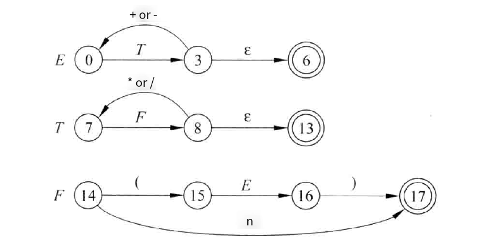

##### 递归调用程序

```python
class Parser:
    def __init__(self, s):
        self.s = s + '$'

    def procE(self):
        self.procT()
        print('E->T')
        if self.s[0] == '+':
            self.s = self.s[1:]
            print('E->E+T')
            self.procE()
        elif self.s[0] == '-':
            self.s = self.s[1:]
            print('E->E-T')
            self.procE()
    
    def procT(self):
        self.procF()
        print('T->F')
        if self.s[0] == '*':
            self.s = self.s[1:]
            print('T->T*F')
            self.procT()
        elif self.s[0] == '/':
            self.s = self.s[1:]
            print('T->T/F')
            self.procT()

    def procF(self):
        if self.s[0] == '(':
            self.s = self.s[1:]
            self.procE()
            if self.s[0] == ')':
                self.s = self.s[1:]
                print('F->(E)')
            else:
                raise Exception('Error')
        elif self.s[0] == 'n':
            self.s = self.s[1:]
            print('F->n')
        else:
            raise Exception('Error')
```

根据化简后的状态转移图写出递归调用分析每一个转换图的递归函数，如上所示。

##### 函数入口

```python
if __name__ == '__main__':
    parser = Parser(input())
    parser.procE()
```

调用递归分析起始符 E 的递归函数开始分析，如上所示。

##### 运行结果

运行递归调用预测分析程序输出分析使用的产生式如下：

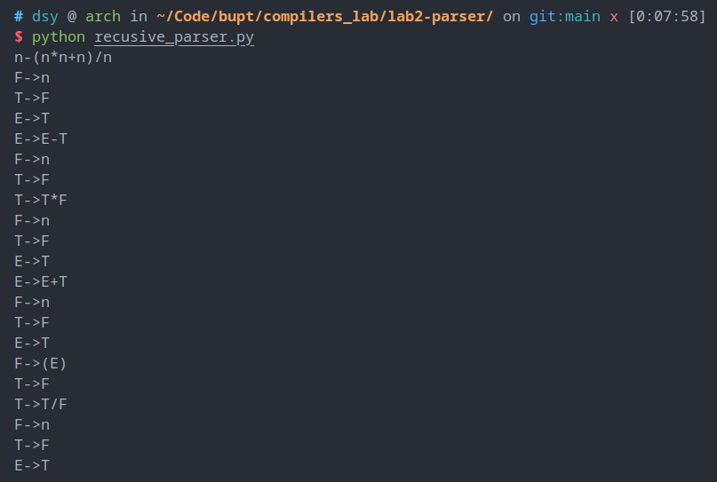

### 方法 2：LL(1) 非递归预测分析

非递归预测分析使用栈来存储分析状态以避免递归对内存的过多占用。方法 2 采用对 LL(1) 文法进行自顶向下非递归分析的方法进行语法分析。

LL(1) 文法每次需要满足以下条件：

- 没有左递归
- 对于每个产生式左边的非终结符 $A$ ，如果 $A$ 有两个以上候选式的话，如 $A\to \alpha_1 | \alpha_2 | \dots | \alpha_n$ ，同时满足以下两个条件：
  - $A$ 的任何两个候选式开头的终结符一定不同
  - 若 $A$ 的每个候选式能推出空，则其他候选式的 $FIRST$ 集合与 $A$ 的 $FOLLOW$ 集合互不相交

LL(1) 预测分析就是每次向前看一个符号，根据当前的栈顶符号和分析表选择下一步的预测分析。

#### 程序设计说明

LL(1) 非递归预测分析源程序由以下文件组成：

- `grammar.py` 文法类 `Grammar` ，包括构成文法的终结符集合、非终结符集合、产生式集合、起始符，以及各文法符号的 $FIRST$ 集合和 $FOLLOW$ 集合
- `LLparser.py ` LL(1) 分析主程序，其中包含语法分析器类 `LLParser` ，包括构造的分析表、分析输入串等成员方法
- `no_recursion.txt` 待分析的文法，输入格式为
  - 第一行为非终结符，用空格隔开
  - 第二行为终结符，用空格隔开
  - 第三行为起始符，一个非终结符
  - 从第四行起若干行，文法产生式

下面逐一分析程序内容

##### Grammar 类

```python
class Grammar:
    def __init__(self, filename: str) -> None:
        self.N = set()
        self.T = set()
        self.S = ''
        self.P = {}
        with open(filename, 'r', encoding='utf-8') as f:
            self.N = set(f.readline().split())
            self.T = set(f.readline().split())
            self.S = f.readline().strip()
            for line in f:
                line = line.strip()
                if line == '':
                    continue
                lhs, rhs = line.split('->')
                lhs = lhs.strip()
                rhs = rhs.strip().split('|')
                if lhs not in self.P:
                    self.P[lhs] = []
                self.P[lhs] += rhs
        self.FIRST = self.first()
        self.FOLLOW = self.follow()
```

构造函数输入为要分析文法所在的文件名，根据文件内容读入文法的终结符集合、非终结符集合、产生式集合、起始符，并调用成员方法构造各文法符号的 $FIRST$ 集合和 $FOLLOW$ 集合

- 非终结符集合是一个 Python 集合，成员为各非终结符
- 终结符集合是是一个 Python 集合，成员为各终结符
- 起始符为一个非终结符
- 产生式集合是一个 Python 字典，键为所有非终结符，值为一个 Python 列表，列表成员为对应的产生式右部
  - 例如文法产生式 `A->BA|a` 表示为 `{'A', ['BA', 'a']}`

##### 构造 FIRST 集合

```python
def first(self) -> dict:
    """求语法所有符号的 FIRST 集

	Returns:
	dict: 语法所有符号的 FIRST 集，键为符号，值为符号的 FIRST 集
    """
    FIRST = {x: set() for x in self.N | self.T}
    while True:
        expanded = False
        for X in self.N | self.T:
            original_size = len(FIRST[X])
            if X in self.T: # 如果是终结符，其FIRST集合就是其本身
                FIRST[X].add(X)
            elif X in self.N: # 如果是非终结符，根据其产生式从左往右逐个找第一个终结符加入集合
                for rhs in self.P[X]:
                    if rhs[0] in self.T or rhs[0] == 'ε': # 产生式第一个符号是终结符，加入
                        FIRST[X].add(rhs[0])
                    elif rhs[0] in self.N and X != rhs[0]: # 产生式第一个是非终结符，将其FIRST除空以外加入
                        FIRST[X].update(FIRST[rhs[0]] - set('ε'))
                        flag = False
                        for i in range(len(rhs) - 1): # 往后继续找，如果连续的非终结符都能推空继续往后找
                            if 'ε' in FIRST[rhs[i]]:
                                flag = True
                                FIRST[X].update(FIRST[rhs[i + 1]] - set('ε'))
                            else:
                                flag = False # 直至遇到终结符或者非终结符不能推空为止
                                break
                        if flag:
                            FIRST[X].add('ε') # 如果产生式右边全是非终结符并且他们的FIRST都含有空，则加入空
            if len(FIRST[X]) > original_size:
                expanded = True
        if not expanded: # 如果一轮下来集合没有扩张，结束
            break
    return FIRST
```

$FIRST$ 集合的数据结构为一个 Python 字典

- 键为所有文法符号，包括终结符和非终结符
- 值为一个 Python 集合，内容为集合内的字符

$FIRST$ 集合构造使用课本上定义 4.3 介绍的构造方法，详见代码注释。

##### 构造 FOLLOW 集合

```python
def follow(self) -> dict:
    """求语法所有非终结符的 FOLLOW 集

    Returns:
        dict: 语法所有非终结符的 FOLLOW 集，键为非终结符，值为非终结符的 FOLLOW 集
    """
    FOLLOW = {x: set() for x in self.N}
    FOLLOW[self.S].add('$') # 首先将$加入起始符的FOLLOW
    while True:
        expanded = False
        for A in self.N: # 对于所有非终结符
            original_size = sum([len(FOLLOW[X]) for X in FOLLOW])
            for rhs in self.P[A]: # 对于这些非终结符的文法产生式
                if rhs == 'ε':
                        FOLLOW[A].add('$') # 如果可以推出空，加入$
                else:
                    for i in range(len(rhs)): # 找到产生式内的非终结符
                        if rhs[i] in self.N:
                            if i < len(rhs) - 1:
                                if rhs[i + 1] in self.T: # 如果这个非终结符后面跟着终结符，这个终结符加入FOLLOW
                                    FOLLOW[rhs[i]].add(rhs[i + 1])
                                elif rhs[i + 1] in self.N: # 如果这个非终结符后面跟着终结符，求后面字串的FIRST
                                    FIRST_alpha = self.first_alpha(rhs[i + 1:])
                                    FOLLOW[rhs[i]].update(FIRST_alpha - set('ε')) # 将非空字符加入
                                    if 'ε' in FIRST_alpha:
                                        FOLLOW[rhs[i]].update(FOLLOW[A])
                                        # 如果后面字串可以推空，将产生式左边非终结符FOLLOW内字符加入该字符FOLLOW
                            elif i == len(rhs) - 1:
                                FOLLOW[rhs[i]].update(FOLLOW[A])
                                # 如果这个非终结符在末尾，将产生式左边非终结符FOLLOW内字符加入该非终结符FOLLOW
            if sum([len(FOLLOW[X]) for X in FOLLOW]) > original_size:
                expanded = True
        if not expanded: # 如果经过一轮计算FOLLOW集没有扩张，结束
            break
    return FOLLOW
```

$FOLLOW$ 集合的数据结构为一个 Python 字典

- 键为文法符号，只包括非终结符
- 值为一个 Python 集合，内容为集合内的字符

$FOLLOW$ 集合构造使用课本上定义 4.4 介绍的构造方法，详见代码注释。

```python
def first_alpha(self, alpha: str) -> set:
    """求某个符号串的 FIRST 集

    Args:
        alpha (str): 符号串

    Returns:
        set: 符号串的 FIRST 集，包含 'ε'
    """
    FIRST = set()
    if alpha == 'ε': # 如果推空，加入空
        FIRST.add('ε')
    else:
        flag = True
        for x in alpha: # 考察字符串的每一个字符
            if x in self.T:
                FIRST.add(x) # 如果第一个字符串是终结符，加入后直接退出
                break
            elif x in self.N: # 如果一直是非终结符，能推出空就用其FIRST更新，一旦不能推出空就跳出，后面无效
                FIRST.update(self.FIRST[x] - set('ε'))
                if 'ε' not in self.FIRST[x]:
                    flag = False
                    break
        if flag:
            FIRST.add('ε') # 如果一直是非终结符且全可推出空，加入空
    return FIRST
```

$FOLLOW$ 集合中计算某个非终结符后面跟着字符串的 $FIRST$ 集合算法如上，详见注释。

##### LLParser 类

```python
from grammar import *

class LLParser(Grammar):
    def __init__(self, filename: str) -> None:
        super().__init__(filename)
        self.TABLE = self.table()
```

继承 Grammar 类，并利用 Grammar 类中求好的 FIRST 和 FOLLOW 集合计算分析表

##### 构造 LL(1) 分析表

```python
def table(self) -> dict:
    """构造 LL(1) 分析表

    Returns:
        dict: LL(1) 分析表，键为非终结符，值为该非终结符的表项，表项为一个字典，键为终结符，值为产生式
    """
    TABLE = {N: {T: '' for T in self.T | set('$')} for N in self.N} # LL(1) 文法，不含多重定义的表项
    for lhs in self.N: # 对文法的所有产生式
        for rhs in self.P[lhs]:
            if rhs == 'ε': # 如果其可推空，产生式左边非终结符对应的行，$列标为空
                TABLE[lhs]['$'] = rhs
                for T in self.FOLLOW[lhs]: # 同时将产生式左边非终结符的FOLLOW中字符对应的列也更新
                    if not TABLE[lhs][T]:
                        TABLE[lhs][T] = rhs
            else:
                for T in self.FIRST[rhs[0]]: # 对产生式右边FIRST内字符更新
                    TABLE[lhs][T] = rhs
                if 'ε' in self.FIRST[rhs[0]]: # 如果可推空产生式左边FOLLOW也更新
                    for T in self.FOLLOW[lhs]:
                        TABLE[lhs][T] = rhs
    return TABLE
```

根据课本算法 4.2 构造 LL(1) 预测分析表，详见注释。

##### 进行 LL(1) 非递归预测分析

```python
def analyze(self, s: str) -> None:
    """语法分析符号串 s

    Args:
        s (str): 待分析的符号串

    Raises:
        Exception: 语法错误，栈顶终结符与缓冲区首符号不匹配
        Exception: 语法错误，栈顶非终结符无法推导出缓冲区首符号
    """
    stack = ['$', self.S] # 先将$入栈，文法起始符入栈
    buffer = s + '$' # 给待分析字符串末尾加上$配对
    while True:
        X = stack[-1]
        if X in self.T or X == '$': # 如果栈顶字符为终结符或$
            if X == buffer[0]: # 如果待识别的下一个字符与栈顶字符相等
                stack.pop() # 栈顶字符推出
                buffer = buffer[1:] # 读入一个字符
            else:
                raise Exception('Syntax Error')
        else:
            if self.TABLE[X][buffer[0]]: # 如果栈顶字符为非终结符
                if self.TABLE[X][buffer[0]] == 'ε': # 如果表项为空符号
                    stack.pop()
                    self.print_stack_and_buffer(stack, buffer, X + '->ε') # 栈顶字符推出并输出当前状态
                else:
                    stack.pop() # 表项不是空符号就将栈顶非终结符推出
                    stack += list(self.TABLE[X][buffer[0]])[::-1] # 将表项内产生式右侧倒序入栈
                    self.print_stack_and_buffer(stack, buffer, X + '->' + self.TABLE[X][buffer[0]])
                    # 并输出当前状态
            else:
                raise Exception('Syntax Error')
        if X == '$': # 如果栈顶字符为$说明分析结束
            break
```

使用课本上算法 4.1 进行非递归预测分析，详见注释。

##### 运行结果

文法文件，已消除左递归：

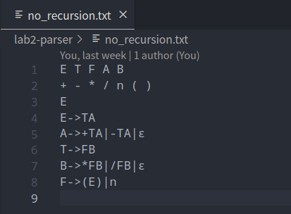

读入以后没有左递归的文法：

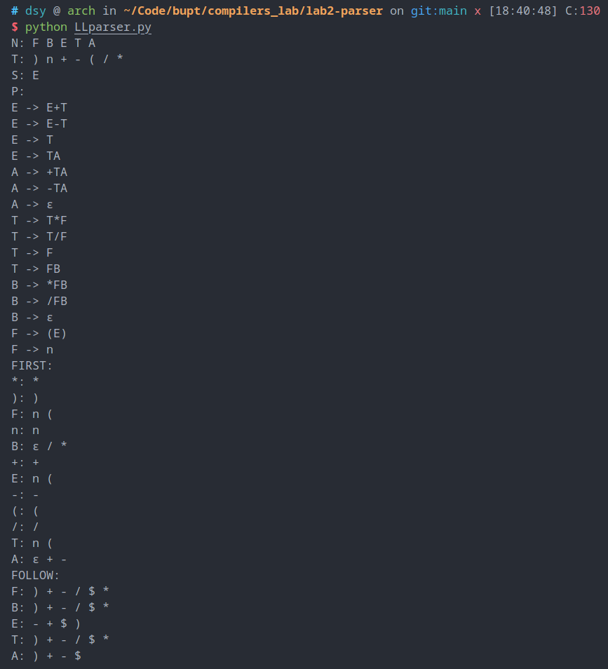

构造的 LL(1) 分析表：

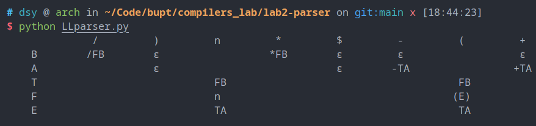

分析过程：

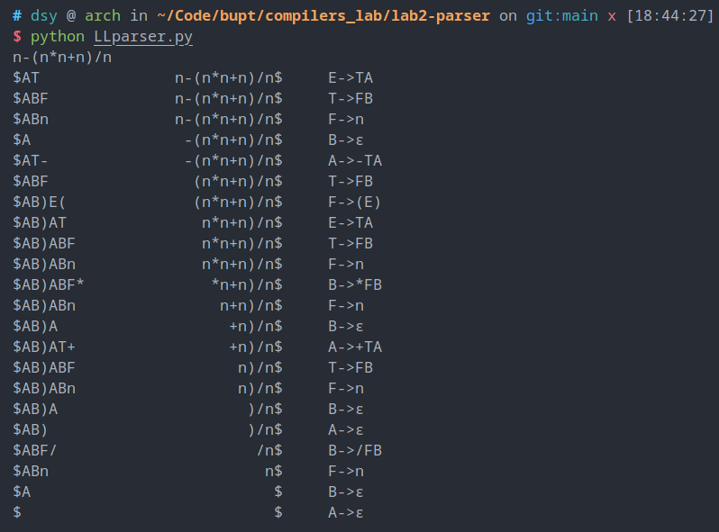

### 方法 3：LR(1) 自底向上分析

与自顶向下的 LL 预测分析不同，LR 预测分析是一种自底向上的分析方法，它先读入足够多的待分析字符串，发现可以规约的句柄后进行规约，在语法树中体现为从叶子到根节点的规范规约，即自底向上。

LR 分析方法自左至右扫描输入串符号，为输入符号串构造一个最右推导的逆过程。本方法采用 LR(1) 分析，即向前看一个符号串以避免“移进-规约”或“规约-规约”冲突。根据手算该文法的有效项目集规范族并构造所有活前缀的DFA可知如果只使用 LR(0) 的有效项目集规范族是不够的。

#### 程序设计说明

##### LRParser 类

```python
from grammar import *

class LRParser(Grammar):
    def __init__(self, filename: str) -> None:
        super().__init__(filename)
        self.TABLE = self.table()
```

LRParser 继承前面的 Grammar 类，因为文法形式和 FIRST 集合与 FOLLOW 集合都是通用的，这样减少了冗余，使代码具有复用性。依然是先读入文法再构造分析表。

```python
def table(self) -> dict:
    self.augment()
    self.dfa()
    return self.construct()
```

构造分析表分为了三个子过程

- 构造拓广文法
- 构造文法的 LR(1) 有效项目集规范族和识别其所有活前缀的 DFA
- 根据 DFA 构造分析表

##### 构造拓广文法

```python
def augment(self) -> None:
    self.N.add('Z')
    self.P['Z'] = [self.S]
    self.S = 'Z'
    self.FIRST = self.first()
    self.FOLLOW = self.follow()
```

添加非终结符 $Z$ ，若原来的起始符为 $S$ ，将 $Z\to S$ 加入产生式，并将起始符改为 $Z$，重新构造 FIRST 和 FOLLOW 集合

##### 构造识别所有活前缀的 DFA

```python
def dfa(self) -> None:
    self.C = []
    self.C.append(self.closure({('Z', '.' + self.P['Z'][0], '$')})) # 初始将[Z->.S,$]的闭包加入规范族
    self.dfa_switch_table = []
    while True:
        expanded = False
        for i in range(len(self.C)): # 对C中每一个项目集Ii
            for X in self.T | self.N: # 和每一个文法符号X
                goto_item = self.goto(self.C[i], X) # 找到其根据X转移后的下一个项目集
                if goto_item and goto_item not in self.C: # 如果不为空且是新的项目集
                    self.C.append(goto_item) # 加入规范族末尾，不会影响当前循环
                    self.dfa_switch_table.append((i, X, len(self.C) - 1)) # 增加一个DFA转移
                    expanded = True
                elif goto_item in self.C:
                    self.dfa_switch_table.append((i, X, self.C.index(goto_item))) # 不是新状态
        if not expanded:# 没有新状态产生，结束
            break
```

`self.C` 是文法的 LR(1) 项目集规范族，为一个 Python 列表，其下标为对应的规范集状态标号

- 列表集合为一个 Python 集合，表示所有 LR(1) 有效项目

- 集合成员是一个 Python 元组，表示一个有效项目
- 元组有三个成员，分别为产生式左边非终结符、产生式右边带圆点、向前看符号
  - 例如项目集 `[A->αBβ, a]` 为元组 `('A', 'αBβ', 'a')`


`dfa_switch_table` 是 DFA 的状态转移表，为一个 Python 列表

- 其列表成员为一个三元组，元组有三个成员，分别为初始状态，经历的文法字符、下一个状态
  - 例如 `(1, 'a', 2)` 表示项目集 $I_1$ 经过文法符号 `a` 到达项目集 $I_2$


LR(1) 项目集规范族及识别所有活前缀的 DFA 使用课本上算法 4.8 构造，详见注释。

```python
def closure(self, I: set) -> set:
    J = I
    while True:
        expanded = False
        for item in J.copy():
            if item[1].index('.') < len(item[1]) - 1:
                B = item[1][item[1].index('.') + 1] # 每一个项目[A->αBβ, a]
                if B in self.N:
                    for rhs in self.P[B]: # 每一个文法产生式 B->η
                        for b in self.first_beta(item[1][item[1].index('.') + 2:], item[2]):
                        # FIRST(βa)中的每一个终结符号 b
                            original_size = len(J)
                            J.add((B, '.' + rhs, b)) # 将[B->.bη]加入项目集
                            if len(J) > original_size:
                                expanded = True
        if not expanded: # 项目集不再扩张，结束
            break
    return J
```

构造项目集闭包使用的是课本上的算法 4.7 ，详见注释。

```python
def first_beta(self, beta: str, b: str) -> set:
    FIRST = set()
    for x in beta:
        if x in self.T:
            FIRST.add(x)
            break
        elif x in self.N:
            FIRST.update(self.FIRST[x] - set('ε'))
            if 'ε' not in self.FIRST[x]:
                break
    if len(FIRST) == 0:
        FIRST.add(b)
    return FIRST
```

构造闭包中求字符串的 FIRST 集合不包含空串 `'ε'` ，将 LL 分析中的 `first_alpha` 函数改写为 `first_beta` ，如上所示。

```python
def goto(self, I: set, X: str) -> set:
    J = set()
    for item in I:
        if item[1].index('.') < len(item[1]) - 1 and item[1][item[1].index('.') + 1] == X:
            J.add((item[0], item[1][:item[1].index('.')] + X + '.' + item[1][item[1].index('.') + 2:], item[2]))
    return self.closure(J)
```

文法有效项目集的 `goto` 函数使用课本上定义 4.15 ，先将所有后继项目加入集合，再返回后继项目集合的闭包，如上所示。

##### 构造 LR(1) 分析表

```python
def construct(self) -> list:
    TABLE = [{x: tuple() for x in self.T | self.N | set('$',)} for i in range(len(self.C))]
    for i in range(len(self.C)):
        for switch in self.dfa_switch_table: # 根据DFA的状态转移表先确定Shift操作和goto表项
            if switch[0] == i:
                if switch[1] in self.T:
                    TABLE[i][switch[1]] = ('S', switch[2])
                elif switch[1] in self.N:
                    TABLE[i][switch[1]] = ('G', switch[2])
        for item in self.C[i]: # 再在每个项目集内部，根据圆点的位置确定ACC和规约操作
            if item[1].index('.') == len(item[1]) - 1:
                if item[0] == 'Z':
                    TABLE[i]['$'] = ('ACC', None)
                else:
                    for p in self.P[item[0]]:
                        if p == item[1][:-1]:
                            TABLE[i][item[2]] = ('R', (item[0], p))
    return TABLE
```

有了有效项目集规范族及其识别所有活前缀的 DFA 后，就可以根据课本上算法 4.9 构造文法的 LR(1) 分析表，如上所示，详见注释。

分析表 `self.TABLE` 数据结构是一个 Python 列表，每一项的下标对应有效项目集的下标。

列表中的元素是一个 Python 字典：

- 键为每个文法符号
- 值为一个元组，表示对应表项的操作，有以下几种：
  - `('S', 2)` 表示由栈顶状态经过一个终结符或 `$` 转移到状态 2，即有效项目集 $I_2$ 对应的状态，也就是 action 表项
  - `('G', 1)` 表示由栈顶状态经过一个非终结符转移到状态 1，即有效项目集 $I_1$ 对应的状态，也就是 goto 表项
  - `('ACC', None)` 表示接收
  - `('R', ('C', 'cC'))` 表示根据文法 `C->cC` 进行规范规约

##### 进行 LR(1) 规约分析

```python
def analyze(self, s: str) -> None:
    s = s + '$' # 初始化将ω$读入缓冲区
    state_stack = [0] # 初始化将状态0入状态栈
    symbol_stack = ['$'] # 符号栈和状态栈同进同出
    while True:
        if not self.TABLE[state_stack[-1]][s[0]]: # 如果分析表项为空，说明有语法错误
            raise Exception('Syntax error')
        action = self.TABLE[state_stack[-1]][s[0]][0] # 分析表项元组第一项为动作标识 S, G, R, ACC
        operation = self.TABLE[state_stack[-1]][s[0]][1] # 分析表项元组第二项为对应的操作
        if action == 'S': # Shift操作，下一个状态operation入状态栈，下一个输入符号s[0]入符号栈
            state_stack.append(operation)
            symbol_stack.append(s[0])
            s = s[1:] # 读入下一个字符
            print_stack_and_buffer(symbol_stack, s, 'S' + str(operation)) # 打印状态信息
        elif action == 'R': # Reduce操作，从栈顶弹出产生式右边的符号，注意状态栈和符号栈同进同出
            lhs = operation[0]
            rhs = operation[1]
            symbol_stack = symbol_stack[:-len(rhs)]
            state_stack = state_stack[:-len(rhs)]
            symbol_stack.append(lhs) # 产生式左边非终结符入栈
            if not self.TABLE[state_stack[-1]][lhs]:
                raise Exception('Syntax error')
            state_stack.append(self.TABLE[state_stack[-1]][lhs][1]) # goto表项入栈
            print_stack_and_buffer(symbol_stack, s, lhs + '->' + rhs) # 打印状态信息
        elif action == 'ACC': # 接受，退出
            break
        else:
            raise Exception('Syntax error')
```

有了 LR(1) 分析表后就可以根据课本上算法 4.3 进行 LR 分析，详见注释。

`state_stack` 为状态栈，为一个 Python 列表

`symbol_stack` 为符号栈，为一个 Python 列表

`s` 为待分析字符串

##### 运行结果

文法文件：

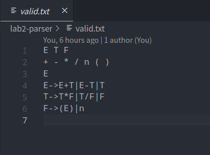

读入并拓广的文法：

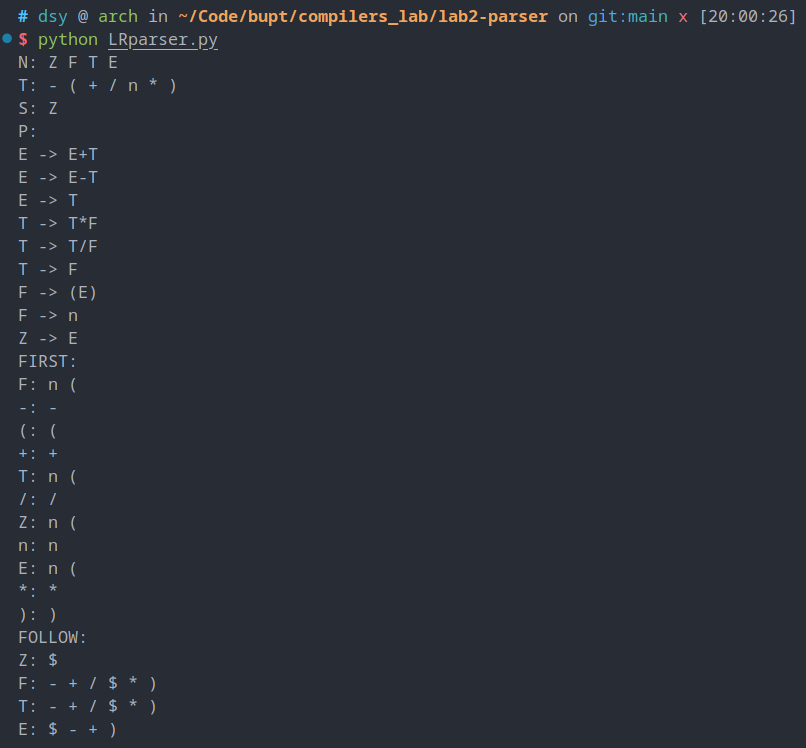

构造的有效项目集规范族及识别所有活前缀的 DFA（输出过长以文本形式呈现）：

```txt
I0:
E->.T, -|$|+
T->.T*F, *|+|$|/|-
F->.n, $|+|/|-|*
T->.F, -|*|$|+|/
T->.T/F, $|+|/|-|*
E->.E+T, -|$|+
Z->.E, $
F->.(E), $|*|+|/|-
E->.E-T, -|$|+

I1:
E->E.+T, +|-|$
E->E.-T, $|+|-
Z->E., $

I2:
E->.T, -|+|)
F->(.E), *|$|+|/|-
T->.T*F, *|+|/|)|-
F->.n, +|/|)|-|*
T->.F, )|-|*|+|/
T->.T/F, +|/|)|-|*
E->.E+T, -|+|)
F->.(E), *|+|/|)|-
E->.E-T, )|-|+

I3:
T->F., *|+|$|-|/

I4:
T->T.*F, *|+|$|-|/
E->T., $|+|-
T->T./F, *|$|+|-|/

I5:
F->n., *|$|+|-|/

I6:
T->.T*F, *|$|+|/|-
F->.n, +|$|/|-|*
T->.F, -|*|+|$|/
E->E+.T, +|$|-
T->.T/F, +|$|/|-|*
F->.(E), *|$|+|/|-

I7:
T->.T*F, *|$|+|/|-
F->.n, +|$|/|-|*
T->.F, -|*|+|$|/
T->.T/F, +|$|/|-|*
E->E-.T, -|+|$
F->.(E), *|$|+|/|-

I8:
E->E.+T, +|-|)
E->E.-T, )|+|-
F->(E.), -|/|$|*|+

I9:
E->.T, -|+|)
F->(.E), *|+|/|)|-
T->.T*F, *|+|/|)|-
F->.n, +|/|)|-|*
T->.F, )|-|*|+|/
T->.T/F, +|/|)|-|*
E->.E+T, -|+|)
F->.(E), *|+|/|)|-
E->.E-T, )|-|+

I10:
T->F., *|+|-|/|)

I11:
T->T.*F, *|+|-|/|)
E->T., +|-|)
T->T./F, *|+|-|/|)

I12:
F->n., *|+|-|/|)

I13:
F->.(E), +|-|/|*|$
T->T/.F, $|-|/|*|+
F->.n, +|$|-|/|*

I14:
F->.(E), +|-|/|*|$
T->T*.F, *|+|$|-|/
F->.n, +|$|-|/|*

I15:
E->E+T., -|$|+
T->T./F, *|$|+|-|/
T->T.*F, *|$|+|-|/

I16:
T->T.*F, *|$|+|-|/
E->E-T., +|$|-
T->T./F, *|$|+|-|/

I17:
F->(E)., -|/|+|*|$

I18:
T->.T*F, *|+|/|)|-
F->.n, +|/|)|-|*
T->.F, )|-|*|+|/
E->E+.T, +|)|-
T->.T/F, +|/|)|-|*
F->.(E), *|+|/|)|-

I19:
T->.T*F, *|+|/|)|-
F->.n, +|/|)|-|*
T->.F, )|-|*|+|/
T->.T/F, +|/|)|-|*
E->E-.T, )|-|+
F->.(E), *|+|/|)|-

I20:
E->E.+T, +|-|)
E->E.-T, )|+|-
F->(E.), -|/|)|*|+

I21:
F->.(E), +|-|/|)|*
T->T/.F, -|/|)|*|+
F->.n, +|-|/|)|*

I22:
F->.(E), +|-|/|)|*
T->T*.F, )|*|+|-|/
F->.n, +|-|/|)|*

I23:
T->T/F., $|-|/|*|+

I24:
T->T*F., *|$|+|-|/

I25:
E->E+T., -|)|+
T->T./F, *|+|-|/|)
T->T.*F, *|+|-|/|)

I26:
T->T.*F, *|+|-|/|)
E->E-T., )|+|-
T->T./F, *|+|-|/|)

I27:
F->(E)., -|/|)|*|+

I28:
T->T/F., -|/|)|*|+

I29:
T->T*F., *|+|-|/|)

I0 - E -> I1
I0 - ( -> I2
I0 - F -> I3
I0 - T -> I4
I0 - n -> I5
I0 - E -> I1
I0 - ( -> I2
I0 - F -> I3
I0 - T -> I4
I0 - n -> I5
I1 - + -> I6
I1 - - -> I7
I2 - E -> I8
I2 - ( -> I9
I2 - F -> I10
I2 - T -> I11
I2 - n -> I12
I4 - / -> I13
I4 - * -> I14
I0 - E -> I1
I0 - ( -> I2
I0 - F -> I3
I0 - T -> I4
I0 - n -> I5
I1 - + -> I6
I1 - - -> I7
I2 - E -> I8
I2 - ( -> I9
I2 - F -> I10
I2 - T -> I11
I2 - n -> I12
I4 - / -> I13
I4 - * -> I14
I6 - ( -> I2
I6 - F -> I3
I6 - T -> I15
I6 - n -> I5
I7 - ( -> I2
I7 - F -> I3
I7 - T -> I16
I7 - n -> I5
I8 - ) -> I17
I8 - + -> I18
I8 - - -> I19
I9 - E -> I20
I9 - ( -> I9
I9 - F -> I10
I9 - T -> I11
I9 - n -> I12
I11 - / -> I21
I11 - * -> I22
I13 - ( -> I2
I13 - F -> I23
I13 - n -> I5
I14 - ( -> I2
I14 - F -> I24
I14 - n -> I5
I0 - E -> I1
I0 - ( -> I2
I0 - F -> I3
I0 - T -> I4
I0 - n -> I5
I1 - + -> I6
I1 - - -> I7
I2 - E -> I8
I2 - ( -> I9
I2 - F -> I10
I2 - T -> I11
I2 - n -> I12
I4 - / -> I13
I4 - * -> I14
I6 - ( -> I2
I6 - F -> I3
I6 - T -> I15
I6 - n -> I5
I7 - ( -> I2
I7 - F -> I3
I7 - T -> I16
I7 - n -> I5
I8 - ) -> I17
I8 - + -> I18
I8 - - -> I19
I9 - E -> I20
I9 - ( -> I9
I9 - F -> I10
I9 - T -> I11
I9 - n -> I12
I11 - / -> I21
I11 - * -> I22
I13 - ( -> I2
I13 - F -> I23
I13 - n -> I5
I14 - ( -> I2
I14 - F -> I24
I14 - n -> I5
I15 - / -> I13
I15 - * -> I14
I16 - / -> I13
I16 - * -> I14
I18 - ( -> I9
I18 - F -> I10
I18 - T -> I25
I18 - n -> I12
I19 - ( -> I9
I19 - F -> I10
I19 - T -> I26
I19 - n -> I12
I20 - ) -> I27
I20 - + -> I18
I20 - - -> I19
I21 - ( -> I9
I21 - F -> I28
I21 - n -> I12
I22 - ( -> I9
I22 - F -> I29
I22 - n -> I12
I0 - E -> I1
I0 - ( -> I2
I0 - F -> I3
I0 - T -> I4
I0 - n -> I5
I1 - + -> I6
I1 - - -> I7
I2 - E -> I8
I2 - ( -> I9
I2 - F -> I10
I2 - T -> I11
I2 - n -> I12
I4 - / -> I13
I4 - * -> I14
I6 - ( -> I2
I6 - F -> I3
I6 - T -> I15
I6 - n -> I5
I7 - ( -> I2
I7 - F -> I3
I7 - T -> I16
I7 - n -> I5
I8 - ) -> I17
I8 - + -> I18
I8 - - -> I19
I9 - E -> I20
I9 - ( -> I9
I9 - F -> I10
I9 - T -> I11
I9 - n -> I12
I11 - / -> I21
I11 - * -> I22
I13 - ( -> I2
I13 - F -> I23
I13 - n -> I5
I14 - ( -> I2
I14 - F -> I24
I14 - n -> I5
I15 - / -> I13
I15 - * -> I14
I16 - / -> I13
I16 - * -> I14
I18 - ( -> I9
I18 - F -> I10
I18 - T -> I25
I18 - n -> I12
I19 - ( -> I9
I19 - F -> I10
I19 - T -> I26
I19 - n -> I12
I20 - ) -> I27
I20 - + -> I18
I20 - - -> I19
I21 - ( -> I9
I21 - F -> I28
I21 - n -> I12
I22 - ( -> I9
I22 - F -> I29
I22 - n -> I12
I25 - / -> I21
I25 - * -> I22
I26 - / -> I21
I26 - * -> I22
```

构造的 LR(1) 分析表：

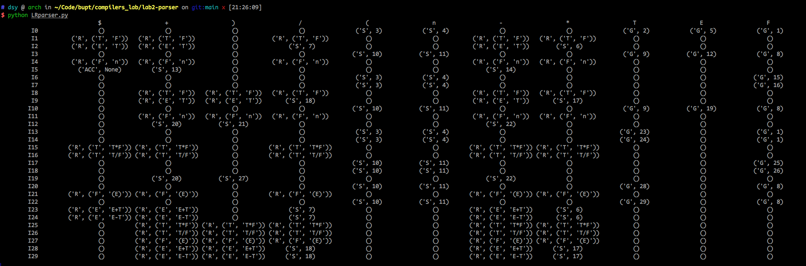

分析过程：

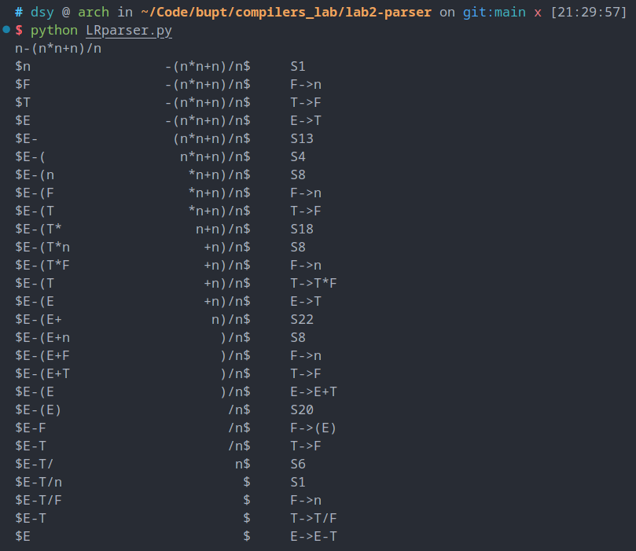


### 方法 4：使用 YACC 语法分析程序生成器

本方法使用更加现代的 flex 和 bison 构建语法分析程序，输出对给定文法进行语法分析时使用的产生式。

yacc 默认使用 LR(1) 分析表，正好输出的产生式能与方法 3 中的顺序吻合。

同时由于使用 yacc 的同时还要使用 lex 词法分析，这样可以输入真实的数字来自动识别 token 而不是像前三种方法只能使用一个非终结符代表 token ，实验效果更好。

#### 程序设计说明

##### 使用 flex 构建词法分析器

在 `calc.l` 中写好规则如下：

```lex
%{
#include "y.tab.h"
%}

%%
[0-9]+          { yylval = atoi(yytext); return num; }
[-/+*()\n]      { return yytext[0]; }
.               { return 0; /* end when meet everything else */ }
%%

int yywrap(void) { 
    return 1;
}
```

其中规则指定了我们要返回的数字 token：`num` 以及运算符单字 token `+` `-` `*` `/` ，输入一行表达式后进行分析

##### 使用 bison 构建语法分析器

在 `calc.y` 中写好规则如下：

```yacc
%{
#include <stdio.h>
int yylex(void);
void yyerror(const char* msg) {}
%}

%token num

%%
E   :   E '+' T { printf("E->E+T\n"); }
    |   E '-' T { printf("E->E-T\n"); }
    |   T       { printf("E->T\n"); }
    ;

T   :   T '*' F { printf("T->T*F\n"); }
    |   T '/' F { printf("T->T/F\n"); }
    |   F       { printf("T->F\n"); }
    ;

F   :   '(' E ')'   { printf("F->(E)\n"); }
    |   num         { printf("F->num\n"); }
    ;
%%

int main() {
    return yyparse();
}
```

每当使用一个产生式进行规约时就输出使用的这个产生式

##### 使用 makefile 构建可执行程序

```makefile
calc: y.tab.c lex.yy.c
	gcc -o calc y.tab.c lex.yy.c

lex.yy.c: calc.l
	flex calc.l

y.tab.c: calc.y
	bison -vdty calc.y

clean:
	rm -f calc lex.yy.c y.tab.c y.tab.h y.output
```

根据前面的 flex 规则和 bison 规则，将构建语法分析器的命令写入 makefile 脚本，执行后即可得到可执行程序 `clac`

##### 运行结果

运行 makefile 脚本：

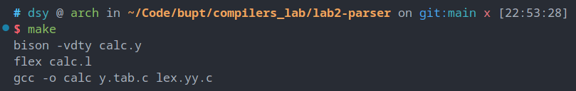

运行可执行程序并输入表达式进行分析，输出分析过程使用的文法产生式：

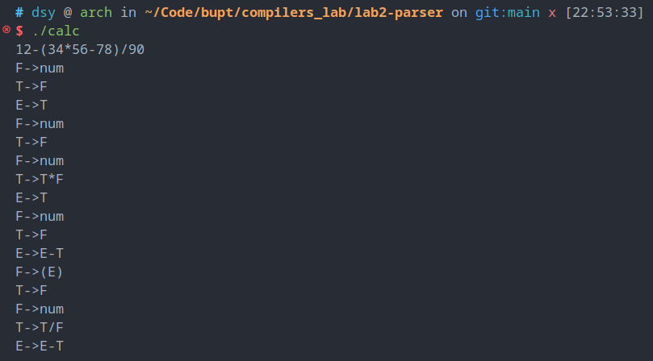

可以看到与方法 3 的产生式一致。
